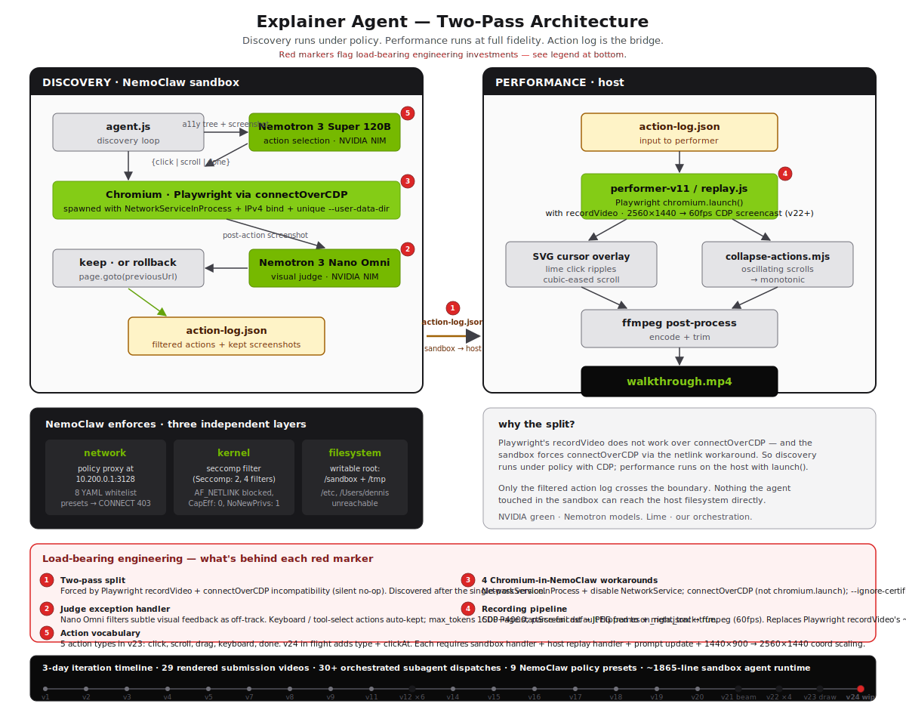

# Explainer Agent

> An autonomous web agent built on Nemotron 3 Super 120B for action selection and Nemotron 3 Nano Omni for visual judging, running under hard NemoClaw policy + seccomp guardrails — it watches itself navigate real docs and produces a cinematic walkthrough that's safe by construction, not by prompt.

**Submission for NVIDIA GTC Taipei 2026 Hackathon.**

**Demo video:** `<YouTube URL — Luceo Studio channel, filled in at submission time>`

---

## What this took

**29 rendered submission videos · 30+ orchestrated subagent dispatches · 7 architectural pivots · ~1865-line sandbox agent runtime · 5 demo sites · 4 documented Chromium-in-NemoClaw workarounds · 9 NemoClaw policy presets**

The agent demos look polished. They are. Each one took real engineering:

- **The two-pass architecture** (NemoClaw sandbox for discovery + host Playwright for cinematic recording) was forced by Playwright's `recordVideo` being silently incompatible with `connectOverCDP`. We discovered this only after building the single-pass version.
- **The 60fps recording pipeline** uses Chrome DevTools Protocol `Page.startScreencast` piping JPEG frames + a `meta.jsonl` timestamp log directly to ffmpeg, because Playwright's built-in `recordVideo` caps at ~25fps with no flag to raise it, and silently no-ops when attached via `connectOverCDP`.
- **The visual judge needed exception handling.** Nemotron 3 Nano Omni rejects subtle visual changes as "off-track" (tool-selection keypresses, intermediate Stripe sidebar pages, Excalidraw mode switches), so the agent runtime now has an auto-keep list for actions that have low visual feedback but high causal value. We also bumped `max_tokens: 1500 → 4000` and flipped the parse-fail default from `on_right_track: false → true` after diagnosing spurious rollbacks caused by the `-reasoning` variant's chain-of-thought trace getting truncated.
- **The agent's action vocabulary grew from 3 to 5+** — original `click` / `scroll` / `done` couldn't draw shapes or run Cmd+K searches. We added `drag` and `keyboard` for the Excalidraw demo (v23), and the in-flight v24 work extends to `type` and `clickAt`. Each new action requires sandbox-side handlers, host-side replay handlers, prompt updates, and coord scaling between sandbox (1440×900) and host (2560×1440) viewports — that's a 1.7778× / 1.6× scale on every coordinate that crosses the boundary.
- **NemoClaw outbound allowlist whack-a-mole.** Every new demo target requires identifying 3–5 subresource hosts (e.g. `docs.stripe.com`, `b.stripecdn.com`, `q.stripe.com`, plus telemetry endpoints) and adding them to the policy YAML. Nine presets shipped: `nemotron-direct`, `github-cdn`, `playwright-cdn`, `remotion-cdn`, `debian-mirror`, `higgsfield`, `brand-fetch`, `demo-targets`, `gemini` (legacy from pre-Nano-Omni judge era).
- **Beam search wasn't free.** The K=4 parallel-scout architecture (`BEAM=1`, used in v21) required attaching per-context CDP screencast on every slot's page, a host-side stitcher (`/tmp/stitch-scouts.py`) that pads every slot to identical duration via `tpad=stop_mode=clone`, and a winner-fallback when Nemotron-Omni declares every branch off-track on hard goals.

## Sample of the iteration log

29 distinct submission videos shipped, plus v24 in flight at submission time. Compressed timeline:

- **v1–v10** — single-pass discovery, Gemini judge, navigation-only vocabulary. Test bed: NeMo Framework PEFT page.
- **v11–v13** — judge swap from Gemini to Nemotron 3 Nano Omni; sandbox/host split forced by recordVideo+connectOverCDP incompatibility discovery.
- **v14–v15** — narrative pivot to NemoClaw's own docs as the demo target ("the agent navigates the docs of the sandbox it runs inside"). Judge-truncation bug fixed.
- **v16–v18** — Stripe docs target, three-click multi-hop ("Find Map payment data"). Pixel-precise overlay re-timing against measured frame timestamps after a parallel-agent coord clobber.
- **v19–v20** — slow-cursor polish pass.
- **v21** — K=4 beam-search parallel-scout video; CDP screencast per slot; 2×2 grid + winner-zoom.
- **v22 series** — 60fps CDP-screencast replacement of `recordVideo` (v22-60fps), full overlays (v22-overlayed), minimal-overlay variant (v22-overlayed-minimal), pixel-precise full overlay re-timed against the 60fps base (v22-overlayed-v2).
- **v23** — Excalidraw "draw a square" demo; action-vocab extension to `drag` + `keyboard`; judge prompt extended with DRAWING-tasks paragraph; 5 excalidraw subresource hosts added to `demo-targets.yaml` (policy v42).
- **v24** — NVIDIA-branded overlay revision (in flight at submission deadline).

Per-version handoff docs live alongside this README at `.handoff-*.md`. Daily decisions and architectural pivots are recorded in `~/.claude/projects/-Users-dennis/memory/project_promo_agent.md` (Dennis's session memory; see `docs/superpowers/specs/2026-05-25-context-handoff.md` for a snapshotted excerpt).

---

## What it does

You give the agent a plain-English goal and a starting URL. It opens a real browser, reads the page, decides where to click, scrolls, backtracks when it goes the wrong way, and stops when it finds what you asked for. Then a second pass replays the discovered path with a smooth cursor overlay and saves the result as an MP4.

```
$ ./explainer-agent/make-explainer.sh \
    "find the LoRA fine-tuning example for Nemotron" \
    "https://docs.nvidia.com/nemoclaw/latest/home"
```

Output: a self-contained explainer video, no human in the loop.

---

## The two-pass architecture

The agent runs in two passes. The first pass discovers a path under kernel-enforced constraints. The second pass replays that path on the host to produce a high-quality recording.



### Pass 1 — discovery (inside NemoClaw sandbox)

`agent.js` spawns Chromium with the four load-bearing flags required to survive NemoClaw's syscall filter ([feedback note](docs/superpowers/specs/2026-05-25-context-handoff.md#5-the-4-architectural-fixes-that-are-load-bearing)) and connects via `connectOverCDP`. Each step:

1. The accessibility tree + a screenshot are sent to **Nemotron 3 Super 120B** (NVIDIA NIM) for action selection — `{click, scroll, done}`.
2. The action is executed in Chromium.
3. The post-action screenshot + goal text are sent to **Nemotron 3 Nano Omni 30B** (NVIDIA NIM) for visual judging — `{at_destination, on_right_track, reasoning}`.
4. If the judge says "off track," `page.goto(previousUrl)` rolls back and that branch is discarded. Otherwise the action is kept.
5. Loop until `done` or `max_steps`.

The filtered `action-log.json` plus the kept screenshots are the only artifacts that cross the sandbox boundary back to the host.

### Pass 2 — performance (on host)

`performer-v11/replay.js` reads the action log, launches headless Chromium via `chromium.launch()` with `recordVideo`, replays the path with an injected SVG cursor + lime click ripples + cubic-eased smooth scrolls, and writes a clean MP4. The recording pass runs on the host rather than inside the sandbox because Playwright's `recordVideo` does not work with `connectOverCDP` — and the sandbox forces `connectOverCDP` via the netlink workaround. Splitting the work this way keeps the discovery side under policy and the rendering side at full fidelity.

### Why two models

- **Nemotron 3 Super 120B** is the action selector. It reasons over the accessibility tree, weighs which link is most likely to advance toward the goal, and emits a single structured action.
- **Nemotron 3 Nano Omni 30B** is the visual judge. It sees the resulting page screenshot and answers whether the agent is closer to the goal or should roll back. Using a smaller multimodal model as a critic catches dead ends the planner misses, without paying Super 120B latency on every step.

Every model in the loop is an NVIDIA Nemotron model called through NVIDIA NIM. There are no third-party model providers anywhere in this submission.

---

## Why this matters

The hackathon theme is **agent autonomy with guardrails**. Most "agent safety" stories are prompt-shaped: the model is asked nicely not to misbehave. This project takes the opposite approach.

Inside the sandbox, the agent has full Nemotron-driven autonomy. It picks every click, every scroll, every backtrack. Nothing in the prompt restricts where it can go. The restriction lives below the agent — at three layers that the model cannot reach:

| Layer | Enforcement | Effect |
|---|---|---|
| **Network** | Policy proxy at `10.200.0.1:3128`, whitelist defined in 8 YAML presets under `agent/presets/` | A request to a non-whitelisted host returns `403 policy_denied` at CONNECT, before any TLS handshake. A jailbroken agent emitting `https://api.openai.com/...` cannot exfiltrate — the tunnel never opens. |
| **Kernel** | seccomp filter (`Seccomp: 2`, 4 stacked filters), `NoNewPrivs: 1`, `CapEff: 0` | `socket(AF_NETLINK, ...)` returns `EPERM`. This is the load-bearing reason Chromium needs its `NetworkServiceInProcess` workaround — even a process as sophisticated as Chrome has to bend to the filter. |
| **Filesystem** | Writable root scoped to `/sandbox` and `/tmp`; `/`, `/etc`, and `/Users/dennis` are unwritable or non-existent | A compromised npm transitive dep cannot reach `~/.ssh`, `~/.aws`, or any host config. |

The full evidence — captured 403s, the allowed-host control, `/proc/self/status`, the netlink EPERM, the filesystem write tests — is in [`docs/nemoclaw-audit.md`](docs/nemoclaw-audit.md). Every claim is line-cited against the preset YAMLs and reproducible from the appendix.

This is what "agent autonomy + guardrails" looks like when the guardrails are real: the agent can want to go anywhere, and it still can't.

---

## Run it yourself

### Prerequisites

- macOS or Linux
- Docker Desktop
- Node 22+
- `NVIDIA_API_KEY` exported in your shell (the single key powers both the action selector and the judge — they share the NIM endpoint)
- NemoClaw installed with a sandbox named `promo-agent`

### One-shot

```bash
git clone <REPO_URL> promo-agent
cd promo-agent

# Apply the 8 policy presets to the sandbox
for f in agent/presets/*.yaml; do
  nemoclaw promo-agent policy-add --from-file "$f" --yes
done

# Push the agent into the sandbox
cat /tmp/sandbox-agent.js | base64 \
  | nemoclaw promo-agent exec -- bash -c 'base64 -d > /sandbox/explainer-agent/agent.js'

# Run end-to-end (discovery + performance + render)
./explainer-agent/make-explainer.sh \
  "find the LoRA fine-tuning example for Nemotron" \
  "https://docs.nvidia.com/nemoclaw/latest/home" \
  20
```

`make-explainer.sh` accepts three arguments: `"<goal>" "<start_url>" [max_steps]`. The output MP4 lands in `explainer-agent/` with a timestamp + slug filename.

The default demo URL is NemoClaw's own documentation — the agent navigating the docs of the sandbox it runs inside. That is intentional.

---

## Repo structure

```
promo-agent/
├── README.md                                  this file
├── SUBMISSION.md                              hackathon judge narrative
├── agent/
│   └── presets/                               8 NemoClaw policy presets (network whitelist)
├── explainer-agent/
│   ├── make-explainer.sh                      host-side entrypoint
│   ├── agent.js                               sandbox-side discovery loop (staging copy)
│   ├── performer-v11/replay.js                host-side performance + recording
│   ├── collapse-actions.mjs                   post-processor: collapses oscillating scrolls
│   ├── remotion/                              alternate native-rebuild composition path
│   └── guardrail-clip/evidence/               captured 403 / seccomp / fs-isolation artifacts
└── docs/
    ├── architecture.svg                       two-pass architecture diagram
    ├── nemoclaw-audit.md                      evidence-cited policy audit
    └── nemoclaw-audit.docx                    shipped audit (10 pages, 6 figures)
```

---

## License + contact

License: `<TBD — Dennis to fill>`

Contact: Dennis Wang — `<email — Dennis to fill>` — built solo for Luceo Studio.
