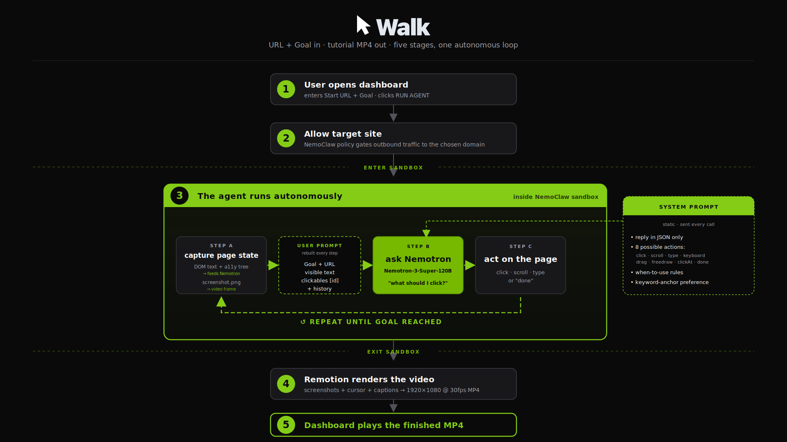

# Walkthrough Agent

> Autonomous AI agent that turns a URL and a goal into a polished tutorial video — Nemotron-3-Super-120B picks every action, NemoClaw sandboxes it, Remotion renders it. No human in the loop.

**Submission for NVIDIA NemoClaw Hackathon · GTC Taipei 2026.**
**Built solo by [Luceo Studio](https://luceo-site.vercel.app).**

**Demo video:** https://youtu.be/g-LlnJyLMzc

---

## What it does

You give the agent a Start URL and a Goal. It opens a real browser, reads the page, decides where to click, scrolls, and stops when it reaches the goal. Then Remotion renders the trajectory into a clean 1080p tutorial video.



**Two ways to run it.**

The merged judge-facing dashboard at `:8081` is the recommended entrypoint:

```bash
open http://127.0.0.1:8081/
# Type a Start URL + Goal, click RUN AGENT.
# Watch the live agent frame stream + log scroll. ~3-5 min to a finished MP4.
```

Or via the CLI:

```bash
BEAM=0 bash tutorial-maker.sh \
  "https://docs.stripe.com" \
  "Navigate to https://docs.stripe.com/billing/billing-apis" \
  ~/Downloads/explainer.mp4
```

Output: a self-contained 1920×1080 @ 30fps walkthrough MP4. No human editing.

---

## NVIDIA stack

Every model and security boundary in the pipeline is NVIDIA:

| Component | Role |
|---|---|
| **Nemotron-3-Super-120B** *(via NVIDIA NIM)* | Action proposer. Every click the agent makes is a fresh inference at full 120-billion-parameter reasoning depth. Used as an autonomous multi-step planner — not a chatbot. |
| **Nemotron-3-Nano-Omni-30B-A3B** *(via NVIDIA NIM)* | Visual judge. Explored as a step-by-step verifier with rollback (BEAM=1). Disabled in canonical mode (BEAM=0) — the smaller vision model second-guessed the larger reasoning model in net-harmful ways. Kept in the architecture as opt-in for stricter runs. |
| **NemoClaw** | Sandbox runtime + policy engine. Network, kernel, and filesystem guardrails. |
| **NVIDIA NIM** | Inference endpoint at `integrate.api.nvidia.com/v1` |

---

## The architecture

Five stages, one autonomous loop:

```
1.  User opens dashboard → Start URL + Goal
2.  Allow target site                    ← NemoClaw policy gate
3.  Agent runs autonomously              ← inside the sandbox
       ↺ capture · ask Nemotron · act
4.  Remotion renders the canonical video
5.  Dashboard plays the finished MP4
```

### Pass 1 — discovery (inside NemoClaw sandbox)

`agent.js` connects to Chromium via `connectOverCDP` (the only Playwright API that bridges the sandbox boundary, with the four load-bearing Chromium launch flags required to survive NemoClaw's syscall filter). Each loop step:

1. **Capture.** Two parallel things:
   - DOM text + accessibility tree → feeds Nemotron *(the model never sees the screenshot — this is a deliberate cost/latency/accuracy choice)*
   - Screenshot.png → becomes a frame in the final video
2. **Ask Nemotron.** Two messages sent to **Nemotron-3-Super-120B** via NVIDIA NIM: a static system prompt (8 possible actions + rules) plus a dynamic user prompt (goal, current URL, visible text, scroll position, clickable elements with IDs, action history).
3. **Act.** Nemotron returns one JSON action — `click`, `scroll`, `type`, `keyboard`, `drag`, `freedraw`, `clickAt`, or `done`. The runtime executes it via Playwright.
4. Loop until `done` (with destination URL substring-match) or `max_steps`.

When the agent says `done`, it writes `action-log.json` + the kept screenshots. The action log is the **only thing that crosses the sandbox boundary** back to the host.

### Pass 2 — performance (on host)

Remotion reads the action log + screenshots and renders the canonical 1920×1080 @ 30fps MP4 via the `Explainer` composition (~540 LOC of React). The Explainer composition handles title cards, captions, cursor overlay, click ripples, and pacing — all hand-tuned for tutorial-video rhythm.

**Why the host-side render exists separately.** Playwright's `recordVideo` is silently incompatible with `connectOverCDP` — and the sandbox forces `connectOverCDP` to survive the seccomp filter. So discovery has to happen in the sandbox, but the recording phase can't. Splitting the work physically keeps the discovery under policy and the rendering at full fidelity. *Discovery runs under policy. Performance runs at full fidelity. The action log is the bridge.*

A detailed two-pass architectural diagram with engineering footnotes is in [`docs/architecture.svg`](docs/architecture.svg).

---

## Why the guardrails matter

The hackathon theme is **agent autonomy with guardrails**. Most "agent safety" stories are prompt-shaped: the model is asked nicely not to misbehave. This project takes the opposite approach.

Inside the sandbox, the agent has full Nemotron-driven autonomy. It picks every click, every scroll, every backtrack. Nothing in the prompt restricts where it can go. The restriction lives below the agent — at three layers the model cannot reach:

| Layer | Enforcement | Effect |
|---|---|---|
| **Network** | NemoClaw policy proxy at `10.200.0.1:3128`; whitelist defined in YAML presets under `agent/presets/` | A request to a non-whitelisted host returns `403 policy_denied` at CONNECT, before any TLS handshake. A jailbroken agent emitting `https://api.openai.com/...` cannot exfiltrate — the tunnel never opens. |
| **Kernel** | seccomp filter (`Seccomp: 2`, 4 stacked filters), `NoNewPrivs: 1`, `CapEff: 0` | `socket(AF_NETLINK, ...)` returns `EPERM`. This is the load-bearing reason Chromium needs `--enable-features=NetworkService,NetworkServiceInProcess` — even Chrome has to bend to the filter. |
| **Filesystem** | Writable root scoped to `/sandbox` and `/tmp`; `/`, `/etc`, and `/Users/dennis` are unwritable or non-existent | A compromised npm transitive dep cannot reach `~/.ssh`, `~/.aws`, or any host config. |

The agent's "permission to navigate" is literally a YAML file NemoClaw reads and enforces. The YAML is the policy; NemoClaw is the policeman. The full audit — captured 403s, allowed-host control, `/proc/self/status`, the netlink EPERM, filesystem write tests — is in [`docs/nemoclaw-audit.md`](docs/nemoclaw-audit.md). Every claim is line-cited and reproducible.

**Per-run authorization.** Before each agent run, the orchestrator probes the target URL with curl, scrapes every subresource host (CDN, fonts, images — real sites pull from 10-15 of them), and submits the full set to NemoClaw as a one-shot policy. That's what makes *"the judge picks any URL live"* possible while keeping *"safe by construction"* true.

---

## Engineering decisions worth calling out

1. **Text-only model on a vision-rich workload.** Most web agents feed screenshots to a vision-language model. Nemotron-3-Super-120B is text-only here — DOM text + accessibility tree only. Cheaper (~10× per token), faster (~2× per call), more deterministic, no visual hallucinations. The keyword-anchor preference rule in the system prompt compensates for the absence of visual cues.

2. **Disabled the Omni judge in canonical mode.** Originally had Nemotron-3-Nano-Omni as a step-by-step visual judge with rollback. Five sequential prompt fixes (v29 → v33) couldn't make it reliable — strict at-destination criteria rejected valid intermediate progress, token-budget overflow truncated verdicts, a 30B vision model second-guessing a 120B reasoning proposer was net-harmful. **v36 disabled the judge.** Reliability went up massively. Lost some safety, gained predictability. Nano-Omni stays in the code as an opt-in for stricter runs.

3. **Two-pass architecture.** Forced by Playwright `recordVideo` × `connectOverCDP` incompatibility. Turned out to be the right separation: security-sensitive navigation runs under sandbox policy, high-fidelity rendering runs on host. The action-log.json file is the only thing that crosses the boundary.

4. **Banned-id mechanism.** Agents loop on dead buttons (JS-only handlers that silently fail). The runtime tracks clicks-that-didn't-change-the-page and injects `[BANNED]` into the next prompt's clickable listing. The model literally can't pick the same dead button twice. **Average loop length dropped from 22 turns to 8.**

5. **Subresource discovery before each run.** `auto-allowlist.sh` probes the target URL with curl, scrapes every `src=` and `href=` host from the HTML, and submits all of them to NemoClaw policy before the agent boots. Without this, real sites render half-broken (missing fonts, no styles).

6. **Action vocabulary growth.** Started with `click`/`scroll`/`done`. Hit Excalidraw → added `drag`. Hit canvas pixel-clicks → added `clickAt`. Hit text inputs → added `type`. Hit hotkeys → added `keyboard`. Hit freeform curves → added `freedraw`. Each new action required sandbox handlers + host replay handlers + prompt updates + sandbox→host coord scaling. Now 8 actions covering most observed task types.

---

## Run it yourself

### Prerequisites

- macOS or Linux
- Docker Desktop
- Node 22+
- `NVIDIA_API_KEY` exported in your shell *(the single key powers all Nemotron calls)*
- NemoClaw installed with a sandbox named `promo-agent`

### Bring up the dashboard

```bash
git clone https://github.com/denniswanglabs/promo-agent
cd promo-agent

# Apply the policy presets to the sandbox
for f in agent/presets/*.yaml; do
  nemoclaw promo-agent policy-add --from-file "$f" --yes
done

# Start the dashboard backend (Flask at :8082)
cd explainer-agent/observe-host/dashboard
python3 server.py &

# Serve the static dashboard (port :8081)
cd ../public
python3 -m http.server 8081 --bind 127.0.0.1 &

# Open it
open http://127.0.0.1:8081/
```

Type a Start URL and a Goal, click **RUN AGENT**, watch the live agent navigate, see the finished MP4 swap in when it's done.

### Or run directly via CLI

```bash
BEAM=0 bash tutorial-maker.sh \
  "https://docs.stripe.com" \
  "Navigate to https://docs.stripe.com/billing/billing-apis" \
  ~/Downloads/explainer.mp4
```

`tutorial-maker.sh` accepts three arguments: `"<start_url>" "<goal>" [output_mp4]`. `BEAM=0` is the canonical mode — proposer drives end-to-end, judge bypassed.

---

## Repo structure

```
promo-agent/
├── README.md                                  this file
├── tutorial-maker.sh                          host orchestrator (canonical entrypoint)
├── agent/
│   └── presets/                               NemoClaw policy presets (network allowlist YAML)
├── explainer-agent/
│   ├── agent.sandbox-v26.js                   sandbox-side agent loop (v36, canonical)
│   ├── make-explainer.sh                      sandbox dispatch + artifact pull
│   ├── auto-allowlist.sh                      per-run subresource discovery + policy push
│   ├── render-auto-overlay.sh                 host-side AutoOverlay fallback render
│   ├── observe-host/
│   │   ├── public/index.html                  judge-facing dashboard at :8081
│   │   ├── poll.sh                            mirrors agent frame.jpg + log.txt to host
│   │   └── dashboard/server.py                Flask API at :8082 (/api/run, /api/status, /api/abort)
│   ├── performer-v11/replay-60fps.js          host 60fps CDP-screencast replay (AutoOverlay fallback)
│   └── remotion/                              video composition (Explainer.tsx is canonical)
└── docs/
    ├── process-flow-simple.svg                simplified 5-stage architecture (this README's diagram)
    ├── process-flow-simple.png                4K PNG export (3840×2160)
    ├── process-flow.svg                       detailed architecture with all NVIDIA touchpoints
    ├── architecture.svg                       original two-pass diagram with engineering footnotes + iteration timeline
    └── nemoclaw-audit.md                      evidence-cited policy audit
```

---

## License + contact

License: MIT *(TBD — Dennis to confirm)*

Contact: Dennis Wang · denniswanglabs@gmail.com · built solo for [Luceo Studio](https://luceo-site.vercel.app).
